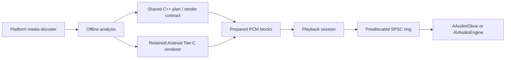

# Architecture

AutoRemix separates the realtime data plane from the offline control plane.
The C++ core is the portable planner/render contract. The iOS bridge renders
through it. Android currently uses it for native lifecycle/output primitives
while the retained Java Tier-C renderer is ported behind the same contract.

The callback side only reads pre-rendered blocks. It does not decode, allocate,
lock, infer, read files, log, or access the network.

Start with [current state](docs/architecture/CURRENT_STATE.md), then read the
[target state](docs/architecture/TARGET_STATE.md),
[implementation plan](docs/architecture/IMPLEMENTATION_PLAN.md), and ADRs in
`docs/architecture/decisions/`.
