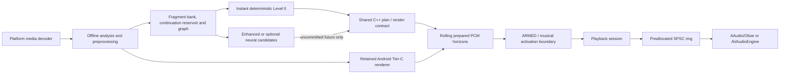

# Architecture

AutoRemix separates the realtime data plane from the offline control plane.
The C++ core is the portable planner/render contract. The iOS bridge renders
through it. Android currently uses it for native lifecycle/output primitives
while the retained Java Tier-C renderer is ported behind the same contract.

The callback side only reads pre-rendered blocks. It does not decode, allocate,
lock, infer, read files, log, or access the network.

## Progressive transition invariants

Target selection and audible activation are separate. Track A follows its
natural runway while preparation moves through candidate discovery and quality
gates. `TRANSITIONING` is forbidden until at least one valid candidate is
`ARMED`; activation then waits for the next suitable musical boundary.

The deterministic Level 0 candidate is prepared first. The continuation
reservoir and bounded graph search extend short runway with distinct fragments,
exclude recent fragment IDs and melodic fingerprints, reject infinite
self-edges, and require arrangement novelty. Low-watermark recovery stops
expensive work and refills with deterministic playable PCM without copying the
last block.

The rolling horizons are:

- committed: 2 bars, immutable;
- guaranteed rendered: at least 8 bars of playable PCM;
- target rendered: 16–32 bars;
- planning: 32–64 bars.

Enhanced deterministic or neural candidates may replace only uncommitted
future blocks at a safe boundary. Failure, cancellation, or thermal throttling
cannot reduce the guaranteed horizon. No neural provider, model, or weights are
bundled, so the shipped path remains deterministic Tier C.

The control plane exposes natural runway, generation ETA, all horizon sizes,
candidate level, recent fragment IDs, repetition/novelty scores, low-watermark
events, neural upgrades, and fallback reason. It logs outside the audio thread
and exports no user audio. Named-device latency, memory, cache, battery,
thermal, inference, and underrun measurements remain required.

Start with [current state](docs/architecture/CURRENT_STATE.md), then read the
[target state](docs/architecture/TARGET_STATE.md),
[implementation plan](docs/architecture/IMPLEMENTATION_PLAN.md), and ADRs in
`docs/architecture/decisions/`.
