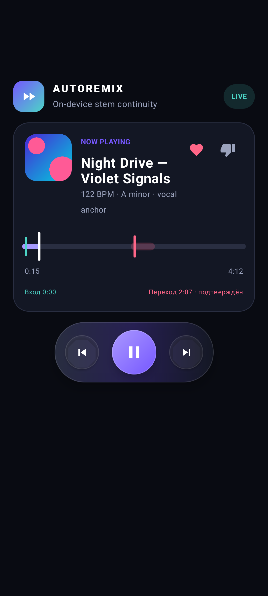
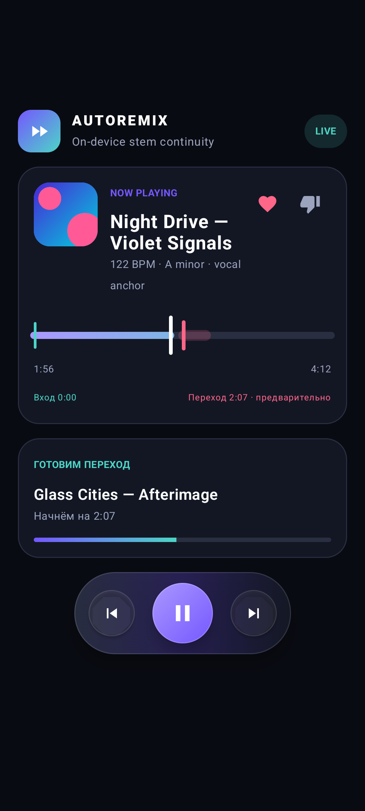
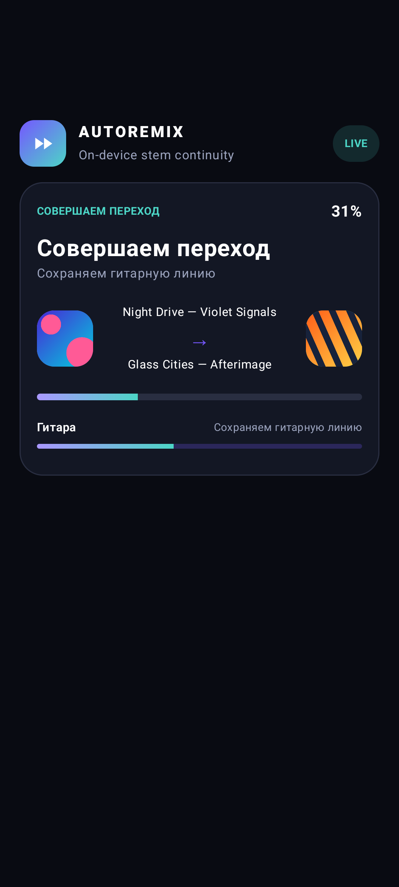
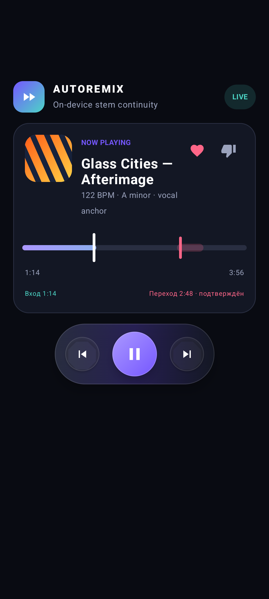
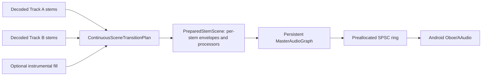
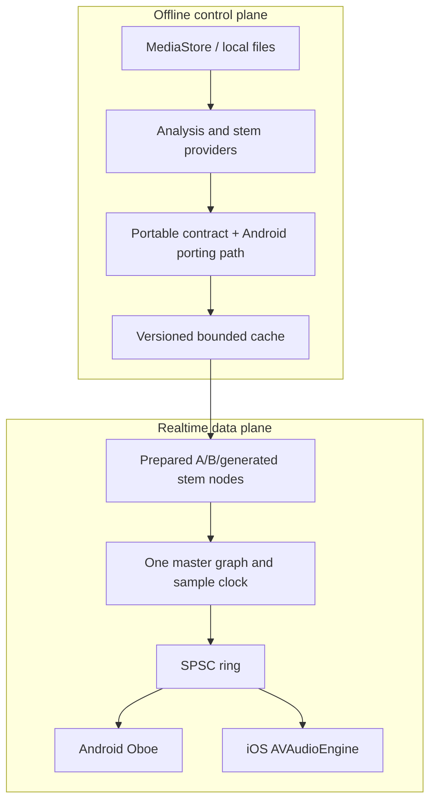

<div align="center">

# AutoRemix

**Do not switch songs. Transform one musical scene into the next.**

[](platform-android/README.md)
[](platform-ios/README.md)
[](https://github.com/shredELIline/autoremix/actions/workflows/ci.yml)
[](https://github.com/shredELIline/autoremix/releases/latest)
[](LICENSE)


Local, deterministic AutoDJ research app for Android and iOS. It plans independent stem timelines, shows each song on its full original timeline, prepares progressive non-repeating continuations, and keeps audio processing offline.

[Showcase](https://shredELIline.github.io/autoremix/) · [Architecture](ARCHITECTURE.md) · [Contributing](CONTRIBUTING.md)

</div>

> Status: working Tier-C vertical slice. Android builds locally. iOS has a native integration target and macOS CI, but was not built in this Windows workspace. No neural model or weights are bundled.

## Download

| Platform | Requirement | Package |
| --- | --- | --- |
| Android | Android 10+ · arm64-v8a or x86_64 | **[Download latest APK](https://github.com/shredELIline/autoremix/releases/latest/download/AutoRemix-android.apk)** |
| iOS | iOS 16+ · Xcode signing required | [Build from source](platform-ios/README.md) — no public IPA yet |

[All versions](https://github.com/shredELIline/autoremix/releases) · [Tags](https://github.com/shredELIline/autoremix/tags) · [Latest checksum](https://github.com/shredELIline/autoremix/releases/latest/download/SHA256SUMS.txt)

> The downloadable APK is a CI-built debug preview. Check `SHA256SUMS.txt`. Its ephemeral debug certificate can require uninstalling an older preview before installing a newer one.

`version.properties` is the version source. CI checks the Git tag, Android `versionName/versionCode`, iOS `MARKETING_VERSION/CURRENT_PROJECT_VERSION`, and changelog. Existing releases are never overwritten.

### Version history

| Version | Android | iOS | Source |
| --- | --- | --- | --- |
| [2.4.0](https://github.com/shredELIline/autoremix/releases/tag/v2.4.0) · code 13 | Preview APK | Source target | `v2.4.0` |
| [2.3.0](https://github.com/shredELIline/autoremix/releases/tag/v2.3.0) · code 12 | Preview APK | Source target | `v2.3.0` |
| [2.2.0](https://github.com/shredELIline/autoremix/releases/tag/v2.2.0) · code 11 | Preview APK | Source target | `v2.2.0` |
| [2.1.1](https://github.com/shredELIline/autoremix/releases/tag/v2.1.1) · code 10 | Preview APK | Source target | `v2.1.1` |
| [2.1.0](https://github.com/shredELIline/autoremix/releases/tag/v2.1.0) · code 9 | Source snapshot | Source target | `v2.1.0` |
| [2.0.0](https://github.com/shredELIline/autoremix/releases/tag/v2.0.0) · code 8 | Historical source snapshot | — | `v2.0.0` |

The machine-readable history is in [`release-history.json`](release-history.json). Each future tag adds a release; previous entries and downloads remain visible.

## Product

A transition is an arrangement change, not two full mixes fading past each other. Each available role receives its own immutable timeline. The planner chooses one anchor and stages the remaining roles around it. Generated provenance is prohibited for vocals.

On Android, selecting Track B prepares decoded B material, deterministic stems, DSP state, and an immutable `ContinuousSceneTransitionPlan`. The same 48 kHz stereo master stream renders A stems, the hybrid scene, the clean-B landing, and the following B runway. No transition WAV, player switch, decoder startup, output restart, or ring reset occurs at activation.

Outside an active transition, the player shows the original song duration and position. Its engine-owned `TrackPlaybackTimeline` carries the entry position, current original position, planned exit, and confirmed next-transition marker. The planner derives these points from the track analysis and available runway instead of fixed playback windows. MediaStore album artwork is shown when available, with deterministic letter artwork as fallback.

While a layered transition is active or landing, the normal progress bar gives way to a transition scene driven by the master audio sample clock. It presents the real A, B, and generated stem operations from the accepted plan. After full landing, the target song timeline returns at its actual non-zero original position.

The continuation reservoir and graph provide distinct compatible fragments instead of one repeated hold loop. Planning excludes recent fragment IDs and melodic fingerprints, rejects infinite self-edges, and requires audible arrangement change across the continuation.

| Full timeline | Preparing | Stem transition | Landed timeline |
| --- | --- | --- | --- |
|  |  |  |  |

More: [all ten timeline fixtures](docs/assets/screenshots/README.md), [transition demo](docs/assets/screenshots/transition-demo.gif), [queue](docs/assets/screenshots/queue-dark.png), [analysis cache](docs/assets/screenshots/analysis-cache-dark.png), and [settings](docs/assets/screenshots/settings-dark.png).

## Audio pipeline



The primary Android path schedules variable musical entry, transition, exit, and landing points from the accepted plan, then queues sufficient target runway before activation. A missed readiness deadline keeps the source playing and retries planning; other primary-path failures use legacy intelligent, phrase-aware, then basic crossfade. Every fallback carries a reason.

The shared C++17 core provides sample-accurate automation, continuation planning, repetition evaluation, diagnostic quality gates, cache identities, lifecycle epochs, rapid-Next coalescing, and a stable C ABI. Audio callbacks only consume pre-rendered PCM from a preallocated lock-free ring. Preparation, logging, and candidate generation stay outside the callback.

Android retains the prototype's MediaCodec decoder, heuristic analysis, HPSS + mid/side complementary separation, WSOLA, beat-phase alignment, and mastering chain as the deterministic provider. This separator is useful for transitions but does not produce studio-clean isolated stems.

## Architecture



- `audio-core/`: portable C++ engine, C ABI, tests, benchmark.
- `platform-android/`: Kotlin, Compose, WorkManager, Media3 session, Oboe JNI.
- `platform-ios/`: SwiftUI, AVAudioEngine, BGProcessingTask, Now Playing.
- `src/`: retained Android Tier-C analysis and rendering provider.
- `docs/`: architecture, ADRs, research, licensed demo audio, static showcase.

See [current-state audit](docs/architecture/CURRENT_STATE.md), [target state](docs/architecture/TARGET_STATE.md), and [implementation plan](docs/architecture/IMPLEMENTATION_PLAN.md).

## Quality tiers

| Tier | Intended device | Repository status |
| --- | --- | --- |
| A | Measured high-end device; licensed neural separation/continuation | Provider boundary and admission policy only |
| B | Compact model plus deterministic DSP | Provider boundary and roadmap only |
| C | HPSS/spatial stems, WSOLA, phase alignment, continuous stem scene | Implemented default |

The core can map caller-supplied throughput, memory, battery, core, and thermal measurements to bounded search profiles. Android currently runs the deterministic Tier-C profile; first-launch device measurement is still roadmap work. A future model must pass the same technical gates and license review. See [on-device ML decision](docs/research/ON_DEVICE_ML.md) and [model licenses](MODEL_LICENSES.md).

The inspector reports original duration and position, entry, planned transition and exit, target landing, playback phase, active stem operations, strategy, provenance, candidate scores and vetoes, fallback reason, activation sample, buffer, underruns, gap, click, loudness, and spectral metrics. Exported JSON contains no user audio or media identity.

## Build

Requirements:

- Android Studio or JDK 17, Android SDK 37, Build Tools 37.0.0, NDK 29.0.14206865, CMake 3.31.6;
- CMake 3.25+, Ninja, and a C++17 compiler for host core work;
- Xcode 16+ on macOS for the iOS target.

Android:

```bash
./gradlew :platform-android:lintDebug \
  :platform-android:testDebugUnitTest \
  :platform-android:assembleDebug \
  :platform-android:bundleDebug
```

The APK and AAB are written under `platform-android/build/outputs/`.

Shared core:

```bash
(cd audio-core && cmake --preset release)
(cd audio-core && cmake --build --preset release)
(cd audio-core && ctest --preset release)
```

iOS:

```bash
xcodebuild -project platform-ios/AutoRemix.xcodeproj \
  -scheme AutoRemix \
  -destination 'platform=iOS Simulator,name=iPhone 16 Pro' \
  CODE_SIGNING_ALLOWED=NO test
```

## Demo

1. Install the debug APK on Android 10+.
2. Grant local audio access.
3. Start the seamless engine.
4. Use Like, Dislike, Next, pause, and seek from the app or media controls.
5. Inspect transition readiness, queue, and local cache state.

The [showcase](docs/index.html) includes reproducible CC0 synthetic A, B, and one 48 kHz continuous stem scene. It does not publish a standalone bridge file. Run it locally:

```bash
python -m http.server 8000 --directory docs
```

Then open `http://localhost:8000`.

The hosted showcase is deployed from `docs/` by [the Pages workflow](.github/workflows/pages.yml).

## Tests and measurements

- deterministic unit, DSP, cancellation, lifecycle, C ABI, and fuzz tests;
- varied-schedule, original-position, landing, playback-phase, and timeline UI tests;
- finite-sample, length, peak, DC, derivative, boundary, loudness, rhythm, harmony, stem-conflict, and anchor-continuity diagnostics;
- Android lint, unit, assemble, and Compose screenshot tests;
- iOS simulator build/tests in macOS CI;
- ASan + UBSan host job;
- reproducible synthetic demo audio, recorded diagnostics, and a host benchmark executable.

Run the benchmark; do not reuse results across devices:

```bash
./scripts/run_core_benchmark.sh
```

Use `./scripts/run_core_benchmark.ps1` on Windows.

Measured reports belong in `docs/benchmarks/` with CPU, OS, compiler, build type, and commit. No phone performance numbers are claimed yet. Real-device latency, memory, cache, battery, thermal, inference, and sustained-underrun measurements are still required.

## Privacy and licensing

- Local music stays on the device.
- Core analysis, planning, rendering, cache, and fallback need no network.
- No analytics, account, ads, or telemetry.
- No DRM extraction or private streaming URLs.
- No copyrighted songs, proprietary weights, signing keys, or tokens are stored here.

Code is [Apache-2.0](LICENSE). Synthetic demo audio is [CC0](docs/assets/audio/LICENSE.md). Review [third-party notices](THIRD_PARTY_NOTICES.md), [model policy](MODEL_LICENSES.md), and [security policy](SECURITY.md).

## Limits

- The bundled separator is deterministic HPSS + spatial DSP, not Demucs or another neural model.
- No neural continuation provider, model, or weights are bundled. Neural upgrades remain an optional provider path.
- Deterministic generation can add a short instrumental fill node; it never generates vocals or a monolithic bridge track.
- Real-device musical quality, battery, thermal behavior, and underruns still need a published device matrix.
- The iOS simulator target is verified by macOS CI; physical hardware and
  signing still require verification.
- Streaming-service integration is intentionally absent.

## Roadmap

- publish real Android device benchmarks and listening tests;
- harden cache corruption, eviction, and restart coverage;
- measure licensed neural stem providers before enabling Tier A/B;
- add iOS snapshot assets from a simulator;
- add stable release signing, SBOM, Play-ready AAB, and reproducible-build verification.

## FAQ

**Does it upload music?** No.

**Does it generate artist vocals?** No. Generated provenance is rejected for vocal roles.

**Is this a normal crossfade?** The primary planner uses independent stem timelines. Phrase-aligned and emergency fallbacks remain continuity-preserving safety paths.

**Are Tier A and B available?** No. Their provider contracts and admission rules exist; Tier C is the implemented path.

**Can it use Spotify, Yandex Music, or DRM streams?** No. Only user-accessible local media is in scope.

## Contributing

Read [CONTRIBUTING.md](CONTRIBUTING.md), the [Code of Conduct](CODE_OF_CONDUCT.md), and the ADRs before changing audio invariants. Security reports follow [SECURITY.md](SECURITY.md).
